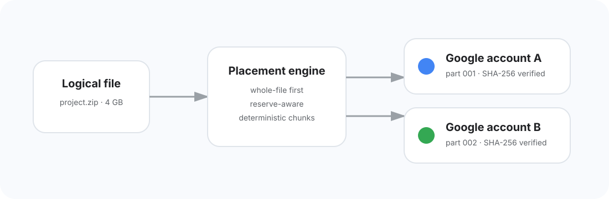

<p align="center"></p>

<p align="center"><strong>One Drive-like workspace across multiple Google storage accounts.</strong></p>

<p align="center">Connect accounts · pool real quota · split oversized files safely · resume transfers · reconstruct on demand</p>

---

## What is Meshly?

Meshly is a virtual filesystem for storage spread across multiple Google accounts. Users work inside one logical workspace while Meshly decides where the underlying bytes live.

If a file safely fits in one healthy account, Meshly keeps it whole. If it does not, the placement engine splits the original byte stream into deterministic parts, stores those parts across available accounts, records integrity metadata, and reconstructs the exact original stream on download.

<p align="center"></p>

## Production feature set

- **Live unified filesystem** — folders, file/folder upload, search, list/grid browsing, breadcrumbs, rename, move, copy, star, trash, restore and permanent delete.
- **Unified storage pool** — real Drive quota and account health are combined into one storage view.
- **Whole-file-first placement** — fragmentation happens only when one account cannot safely hold the complete file.
- **Resumable direct uploads** — the backend creates Google Drive resumable sessions and the browser streams ranges directly to Google instead of proxying multi-GB payloads through Meshly.
- **Incremental SHA-256** — large files are hashed without reading the complete file into browser memory.
- **Cross-account reconstruction** — managed multipart files stream back in logical order with HTTP byte-range support.
- **Managed + Full modes** — Managed mode uses `drive.file`; Full mode can index pre-existing Drive content after the deployment satisfies Google's broader-scope requirements.
- **Signed disaster recovery** — Meshly-managed filesystem/chunk manifests are signed and copied to Drive `appDataFolder`, with restore tooling in the UI.
- **Integrity verification** — physical parts can be re-checked and logical files marked degraded when storage disappears or changes unexpectedly.
- **Secure sharing** — expiring links, optional passwords, download caps, revocation, short-lived signed grants, and persisted authorization-attempt rate limiting.
- **Background maintenance** — scheduled quota refresh, Full Drive change sync, account-health updates and recovery snapshots.
- **Production security** — encrypted refresh tokens, HttpOnly/SameSite sessions, PKCE/state OAuth, CSP/HSTS/security headers, same-origin mutation enforcement and deployment readiness checks.
- **Operational UI** — transfers, notifications/activity, accounts, storage, diagnostics, integrity, recovery, profile, help/privacy, settings, error and empty states.

## Stack

`Next.js 16.3` · `React 19` · `TypeScript` · `Tailwind CSS 4` · Radix/shadcn-style primitives · `Drizzle ORM 0.45.x` · PostgreSQL · Google OAuth 2.0 · Google Drive API · `hash-wasm` · Vitest

## Quick start

```bash
git clone https://github.com/cassielxyz/Meshly.git
cd Meshly
pnpm install --frozen-lockfile
cp .env.example .env.local
pnpm db:migrate
pnpm dev
```

Open `http://localhost:3000`.

## Configuration

Fill every value in `.env.local` using `.env.example`. Meshly validates production configuration through `/api/readiness`; missing or malformed deployment configuration returns HTTP 503 without exposing secret values.

For Google OAuth, create a Web application, enable the Drive API, and configure the exact callback used by `GOOGLE_REDIRECT_URI`:

```text
https://YOUR_DOMAIN/api/auth/google/callback
```

The default Managed flow requests OpenID profile/email plus `drive.file` and `drive.appdata`. Full Drive mode is optional and should only be enabled publicly after the deployment satisfies Google's requirements for the broader Drive scope.

See [DEPLOYMENT.md](DEPLOYMENT.md) for the complete credential and launch checklist.

## Transfer model

1. The browser submits logical metadata to `/api/uploads/plan`.
2. Meshly refreshes/uses healthy account capacity and applies reserve-aware placement.
3. The API creates one or more Google Drive resumable upload sessions.
4. The browser incrementally hashes and uploads the planned source ranges.
5. `/api/uploads/commit` validates the physical objects and promotes the logical file to ready only after all parts verify.
6. `/api/files/:id/download` translates logical byte ranges into one or more Drive byte ranges and streams them in order.
7. Integrity and recovery services can independently verify/rebuild Meshly-managed metadata.

## Product areas

Landing · login · onboarding · My Drive · folders · search · recent · starred · shared · trash · storage pool · connected accounts · transfer center · activity · integrity · recovery · notifications · diagnostics · help · privacy · profile · general/storage/transfer/appearance/security/notification/advanced settings · public share pages · error/404 states.

## Design system

Meshly intentionally feels familiar to Drive users without copying Google Drive's product identity. It uses the Google productivity color family — blue `#4285F4`, green `#34A853`, yellow `#FBBC04`, red `#EA4335` — in an original connected-node Meshly mark. The interface is light-first with complete dark tokens, responsive desktop/mobile navigation, accessible focus states and reduced-motion-aware interaction patterns.

## Verification

Meshly uses a reproducible `pnpm-lock.yaml` and frozen dependency installation. Every push and pull request runs the hardened production gate:

```text
frozen install → checkpoint validation → production dependency security audit → ESLint → strict typecheck → unit tests → optimized production build
```

Locally the matching gate is:

```bash
pnpm verify
```

The production dependency audit rejects high-severity advisories. The current Drizzle ORM line is patched for the SQL-identifier injection advisory affecting versions below `0.45.2`. Dependabot monitors both npm dependencies and GitHub Actions for future updates.

Tests cover storage placement invariants, share-security primitives, and deployment-environment validation. Credential-dependent Google integration behavior is exercised after real OAuth/database credentials are configured.

## Security

Read [SECURITY.md](SECURITY.md) before deployment. Refresh tokens are AES-256-GCM encrypted at rest. Public sharing uses hashed tokens and signed short-lived grants. Unsafe `/api/*` mutations are same-origin guarded by Next.js Proxy. Never expose OAuth refresh tokens or Google resumable-upload session URLs in logs.

## Operations

`vercel.json` schedules `/api/maintenance` daily. The endpoint requires `Authorization: Bearer <CRON_SECRET>` and performs quota/account refresh, Full Drive change synchronization, and recovery-manifest maintenance.

`GET /api/health` is a lightweight service endpoint. `GET /api/readiness` verifies required production configuration, database connectivity, and required migrated schema and should be used as the pre-traffic readiness gate.

After deployment run:

```bash
pnpm production:preflight https://YOUR_DOMAIN --report=.meshly/preflight-report.json
```

The preflight validates HTTPS/security headers, health/readiness, migrated schema, Google OAuth redirect + PKCE, Managed scopes, callback URL, cron protection and cross-origin mutation rejection.

## Durable AI continuation

Meshly carries its project state in the repository so a lost ChatGPT/agent session does not restart completed work. Future agents must read:

- `AGENTS.md`
- `CHECKPOINT.md`
- `.meshly/project-state.json`
- the newest record under `docs/checkpoints/`

`pnpm checkpoint:check` validates the continuation state as part of CI.

## Before the first real-user test

The code build and deployment tooling are complete. The remaining launch sequence is:

1. Provision the production PostgreSQL database with TLS.
2. Add all environment variables from `.env.example`.
3. Run `pnpm db:migrate` against production.
4. Deploy `main` to Vercel/Node 22+.
5. Run `pnpm production:preflight` and require every check to pass.
6. Complete [PRODUCTION_TESTING.md](PRODUCTION_TESTING.md), including a forced two-account split/reconstruction SHA-256 test.
7. Run `pnpm release:check` and `pnpm verify` before creating the production release.

## Contributing

See [CONTRIBUTING.md](CONTRIBUTING.md). Changes to placement, manifests, reconstruction, account removal, sharing or recovery must preserve storage/security invariants and include tests.

---

<p align="center"><strong>Meshly</strong> · All your storage. One workspace.</p>