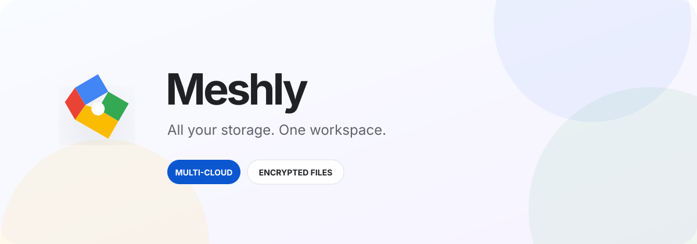

<p align="center"></p>

<p align="center"><strong>One workspace across your connected cloud storage.</strong></p>

<p align="center">Google Drives · Other Clouds · encrypted managed files · resumable transfers · integrity checks</p>

---

## What is Meshly?

Meshly is a unified file workspace for storage you already own across different cloud providers. It keeps provider details out of the way while respecting each provider's capabilities, limits and policies.

Meshly has two clear storage areas:

- **Google Drives** — connect multiple Google accounts and browse them from one Meshly workspace. A managed file stays whole inside one selected or automatically chosen Google account.
- **Other Clouds** — a provider-adapter layer for TeraBox, Dropbox, MEGA and future services. MediaFire remains experimental until a suitable current production API is verified.

Google cross-account sharding is intentionally disabled. The generic split engine remains isolated for providers/use cases that explicitly permit distributed physical parts.

## Current product status

The multi-cloud foundation and the first mandatory encrypted managed-file format are implemented in code and have passed the repository CI gates.

Implemented now:

- separate **Google Drives** and **Other Clouds** product areas;
- provider capability registry and provider-aware transfer profiles;
- Google whole-file-only placement;
- optional explicit Google-account selection at the planner/API layer;
- conservative TeraBox profile: one active file and one upload part at a time initially;
- adaptive retry/backoff helpers for providers that permit concurrency;
- versioned encrypted storage for every **new Meshly-managed upload**;
- authenticated/ranged decryption for encrypted managed downloads;
- encrypted-object-aware integrity and recovery metadata;
- client-independent provider/encryption architecture for a later Android app.

Production deployment and real cloud round-trip verification are still pending credentials/database setup. Passing CI does not mean the live Google integration has already been verified.

## Encryption is the storage format

> **Every new Meshly-managed file is encrypted before its bytes are stored by the cloud provider. There is no plaintext-storage switch.**

Encryption v1 uses framed AES-256-GCM with a fresh random 256-bit data-encryption key per file. The file key is wrapped using a domain-separated key derived from `TOKEN_ENCRYPTION_KEY`; plaintext file keys are not persisted in PostgreSQL or recovery manifests.

Full ciphertext frames are exactly 8 MiB so resumable cloud transfer boundaries remain deterministic. Each frame has a unique authenticated nonce derived from a random per-file prefix and frame index. Meshly tracks logical plaintext SHA-256 separately from ciphertext SHA-256 and physical encrypted size.

The Google provider receives opaque `.bin` object names and ciphertext for new Meshly-managed uploads. Downloads map requested plaintext byte ranges to the required encrypted frames, authenticate/decrypt those frames, and preserve HTTP Range behavior.

Legacy managed files created before encryption v1 and externally indexed Google Drive content remain readable for compatibility.

This is **not described as zero-knowledge backend encryption**: the authenticated upload-planning endpoint generates the per-file key and returns it to the browser over TLS while storing only a wrapped copy.

## Provider model

| Area | Provider | State | Initial transfer policy |
| --- | --- | --- | --- |
| Google Drives | Google Drive | Active | whole-file placement, resumable encrypted upload |
| Other Clouds | TeraBox | Adapter planned | sequential remote queue, resumable/multipart-aware |
| Other Clouds | Dropbox | Adapter planned | resumable + adaptive concurrency |
| Other Clouds | MEGA | Adapter planned | SDK/API-backed + adaptive concurrency |
| Other Clouds | MediaFire | Experimental | enable only after current production API support is verified |

Multipart **transport** does not automatically mean Meshly may persist one logical file as several provider objects.

## Transfer engine

Meshly optimizes transfers per provider instead of using one global thread count:

1. inspect provider capabilities and account health;
2. choose a compatible destination;
3. prepare/hash/encrypt managed content;
4. use resumable/multipart transport where supported;
5. increase concurrency only when the provider profile allows it;
6. back off on throttling, timeouts and transient failures;
7. verify the physical encrypted object before making the logical file ready.

For TeraBox, Meshly starts conservatively at one active file and one upload part at a time. Hashing/encryption preparation may run ahead of the remote queue without flooding the provider.

## Open-source references

Meshly studies established open-source storage projects instead of reinventing every transfer pattern:

- **rclone** — provider abstraction, retries/throttling, crypt/chunker/combine concepts;
- **Cloudreve** — client upload architecture, resumability and provider-specific concurrency;
- **OpenList / AList** — provider-driver design and TeraBox operational behavior;
- **TeraBox uploader implementations** — multipart sequencing, upload IDs, hashes and finalization.

These are engineering references, not a reason to copy incompatible code or bypass provider restrictions. Production integrations prefer supported official APIs/SDKs. See [`docs/OPEN_SOURCE_STORAGE_REFERENCES.md`](docs/OPEN_SOURCE_STORAGE_REFERENCES.md).

## Existing Google functionality

The Google implementation includes:

- responsive Drive-style logical filesystem;
- folders, files, search, recent/starred/trash and sharing;
- Managed Google OAuth mode and optional broader Full Drive indexing;
- quota/account health refresh;
- whole-file account placement;
- encrypted resumable managed uploads;
- plaintext and ciphertext integrity metadata;
- authenticated encrypted managed downloads with HTTP Range support;
- integrity scanning;
- signed recovery manifests containing wrapped encryption metadata but no plaintext file keys;
- encrypted OAuth refresh tokens;
- health/readiness endpoints, migrations, cron maintenance and deployment preflight;
- responsive light/dark UI and public interactive demo.

Some landing/demo copy still illustrates the former pooled/split-Google concept and remains scheduled for cleanup.

## Architecture

```text
                         Meshly Core
                              │
               ┌──────────────┴──────────────┐
               │                             │
         Google Drives                  Other Clouds
               │                             │
        Google adapter             Provider adapter layer
                                             │
                                  ┌──────────┼──────────┐
                                  │          │          │
                               TeraBox    Dropbox     MEGA
               └────────────────────┬────────────────────┘
                                    │
                          Provider-aware transfer
                                    │
                        Encryption format v1
                                    │
                         Integrity + recovery
```

Provider, transfer, encryption and manifest logic stays outside React UI code so the same storage format can later power Android without rewriting the cloud layer.

Read [`ARCHITECTURE.md`](ARCHITECTURE.md) for the invariants and provider contract.

## Stack

`Next.js 16.3` · `React 19` · `TypeScript` · `Tailwind CSS 4` · Motion · Drizzle ORM · PostgreSQL · Google OAuth 2.0 · Google Drive API · `hash-wasm` · Vitest

## Quick start

```bash
git clone https://github.com/cassielxyz/Meshly.git
cd Meshly
pnpm install --frozen-lockfile
cp .env.example .env.local
pnpm db:migrate
pnpm dev
```

Open `http://localhost:3000`.

## Google configuration

Create a Google OAuth Web application, enable the Drive API, and configure the exact callback in `GOOGLE_REDIRECT_URI`:

```text
https://YOUR_DOMAIN/api/auth/google/callback
```

Managed mode requests OpenID profile/email plus `drive.file` and `drive.appdata`. Full Drive mode is optional and should only be exposed publicly after the deployment satisfies applicable Google requirements for the broader Drive scope.

See [`DEPLOYMENT.md`](DEPLOYMENT.md).

## Verification

Every pull request and push to `main` runs:

```text
frozen install
→ checkpoint validation
→ production dependency security audit
→ ESLint
→ strict TypeScript
→ Vitest
→ optimized production build
```

Local equivalent:

```bash
pnpm verify
```

The encryption milestone includes tests for frame layout, unique IV derivation, file-key wrapping/binding, authenticated frame round-trips and ciphertext tamper detection. Real provider testing is still required after production credentials are configured.

## Security

Read [`SECURITY.md`](SECURITY.md) before deployment.

Current protections include encrypted Google refresh tokens, HttpOnly/SameSite sessions, PKCE/state OAuth, same-origin mutation guards, CSP/HSTS/security headers, protected maintenance endpoints, and mandatory encryption v1 for new Meshly-managed file objects.

Recovery metadata must never contain provider refresh tokens, application secrets or plaintext file keys.

## Roadmap from here

1. Expose manual Google-account destination selection in the upload UI.
2. Update landing/demo copy away from Google cross-account sharding.
3. Finish production PostgreSQL + migration `0005`, credentials and deployed preflight.
4. Run real encrypted Google upload/download SHA-256 round trips, resume tests, ciphertext inspection and recovery/integrity tests.
5. Implement the supported TeraBox adapter with its conservative transfer queue.
6. Add Dropbox and MEGA adapters.
7. Verify whether MediaFire currently supports a suitable production API before enabling it.
8. Build the Android client on top of the same provider/encryption/manifest format.

## Durable continuation

Future coding agents must read:

- `AGENTS.md`
- `CHECKPOINT.md`
- `.meshly/project-state.json`
- newest file in `docs/checkpoints/`

The repository checkpoint is the source of truth when chat context is lost.

---

<p align="center"><strong>Meshly</strong> · All your storage. One workspace.</p>
